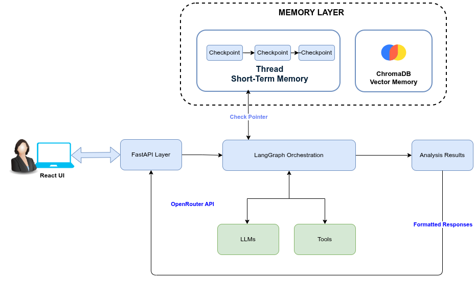

> **INFO:** Project Name: AgentOps Monitor
> Track: Backend Dev
> Team: Zeta
> Team Memebers: Ardra Haridas & Reshma M M 

# AutoML Arena: A Multi-Agent Debate System for Model Selection

## Problem Statement

Traditional AutoML systems rely on sequential or brute-force model selection, offering limited transparency into why a particular model is chosen. This lack of interpretability makes it difficult for practitioners to trust or validate model decisions. Additionally, users often need to manually upload datasets, experiment with multiple models, and compare performance metrics, which is time-consuming and error-prone. There is a need for an intelligent, automated system that not only evaluates multiple models but also provides transparent, data-driven reasoning behind model selection.

The **AutoML Debate System** addresses these challenges by providing an end-to-end pipeline for tabular datasets. It performs **EDA**, trains **three competing models** in parallel (Random Forest, XGBoost, and a linear baseline—Logistic Regression or Ridge), evaluates them on a holdout split, hosts a **metric-grounded debate**, and empowers a **judge agent** to pick the most robust model. The system features a **React** UI and **FastAPI** backend, orchestrated with **LangGraph**. **Memory** remembers notes from the current run and patterns from past runs (see [Memory](#memory)). Training steps employ **LangChain `StructuredTool`** wrappers around real `sklearn` / **XGBoost** fit and evaluation code.

The UI is built with **React + Vite**, styled using **Tailwind CSS** and utilizes **Axios** for API interactions.

**Step-by-step run commands (backend, frontend, and curl):** see **[HOW_TO_RUN.md](./HOW_TO_RUN.md)**.

---

## High Level Architecture 

Overview: **React UI** → **FastAPI** (`src/backend/app/main.py`) loads a compiled **LangGraph** graph from **`src/backend/app/graph/workflow.py`** and calls **`graph.invoke(...)`** (sync route uses a **worker thread** for the blocking invoke; async path uses the same).

Graph state is **`DebateGraphState`** (`src/backend/app/state.py`): **reducers** merge dicts for parallel branches (`model_runs`, `model_proposals`, `metrics`) and **concatenate** `reasoning_logs`. After **`memory_retrieve`**, **`route_parallel_model_agents`** emits three **`Send("model_rf"|"model_xgb"|"model_lr", state)`** fan-outs. **Chroma** stores vectors; **LangChain `StructuredTool`** wraps real **sklearn / XGBoost** training. **Memory:** [below](#memory).




- **Synchronous run:** `POST /automl-debate` runs the full graph in a worker thread and returns a single JSON payload (good for scripts and the main UI).
- **Asynchronous run:** `POST /api/v1/debate` enqueues a run and returns a `run_id`; poll `GET /api/v1/debate/{run_id}` until `completed` or `failed`.

State merges across parallel model nodes using **reducers** (e.g. `model_runs`, `model_proposals` as dict merges; `reasoning_logs` concatenated).

### Competing models (Random Forest, XGBoost, linear baseline)

The graph runs **three model agents in parallel** (`model_rf`, `model_xgb`, `model_lr`). Each **proposes hyperparameters with deterministic Python rules** from EDA (plus optional **memory** text from past runs)—**not** an LLM—then **trains and evaluates** on a holdout split. The **debate** and **judge** steps compare them using **real metrics**, not synthetic scores.


| Model                            | Role                                                                                                                                                                                                                                                                                  |
| -------------------------------- | ------------------------------------------------------------------------------------------------------------------------------------------------------------------------------------------------------------------------------------------------------------------------------------- |
| **Random Forest**                | scikit-learn tree ensemble. Strong general-purpose baseline for tabular data; captures non-linearities and interactions without manual feature engineering.                                                                                                                           |
| **XGBoost**                      | Gradient-boosted trees. Often competitive on tabular problems; good at interactions and irregular decision boundaries when settings suit the data.                                                                                                                                    |
| **Linear baseline** (`model_lr`) | Simple linear model for transparency and speed: **Logistic Regression** when the task is **classification** (discrete labels), **Ridge** regression when the task is **regression** (continuous target). Lets you contrast flexible tree models against a classical linear separator. |


Together, **two tree-based models** (RF + XGBoost) and **one linear model** cover a useful spread from interpretable linear fits to expressive ensembles. The judge picks a winner from holdout performance (and related signals such as generalization gap), as described under **Agents** below.

---

## Core Components


| Area          | Technology                                                                                                                      |
| ------------- | ------------------------------------------------------------------------------------------------------------------------------- |
| API           | FastAPI, Uvicorn, Pydantic                                                                                                      |
| Orchestration | LangGraph; LangChain Core; optional **langchain-openai** `ChatOpenAI` (OpenRouter-compatible when `OPENROUTER_API_KEY` is set) |
| ML            | scikit-learn, XGBoost, pandas, NumPy, joblib, PyArrow                                                                           |
| Memory        | Chroma (persistent, under `src/backend/data/chroma/`); optional `pysqlite3-binary` + `sqlite_patch` if system SQLite is too old |
| Frontend      | React 18, Vite 6, TypeScript, Tailwind CSS 3, Axios                                                                             |


Core training/evaluation logic lives in `src/backend/app/tools/ml_tools.py` (preprocessing, `train_model`, `evaluate_model`, artifact paths, `build_training_toolkit`).

---

## Memory

The app uses **two kinds of memory** so later steps are better informed.

**Short-term (this run only):** While your dataset is being processed, the system saves short notes from the EDA step and from the debate—always tied to **your current job**, so nothing from another user’s upload gets mixed in. That helps the debate step (and related logic) pull the right context for **this** CSV.

**Long-term (past runs):** After a run finishes successfully, the system remembers a **fingerprint** of the data (rough size, balance, task type, etc.) and **which model won** with what kind of scores. The **next** time you run a dataset that looks similar, it passes a **short text hint** to the three model trainers so their first-guess settings can lean on **what worked before**, not only the new file.

**How it fits together:** The pipeline runs in order—explore the data → look up similar past runs → train the three models → compare them → debate → judge. Everything travels in one shared **graph state** (including that hint text, metrics, debate output, and judge result).

**Where it lives:** Vector storage uses **Chroma** on disk under `src/backend/data/chroma/` (separate from any optional cloud LLM). On older systems with a very old **SQLite**, the backend may need **`sqlite_patch.py`** so Chroma can start—see project notes.

---

## Tool calling (ML agents)

The stack uses **LangChain `StructuredTool`** to wrap training and evaluation; tools are **invoked from Python** (`StructuredTool.invoke`) in deterministic pipeline code — the LLM does not drive an open-ended tool loop for fitting.


| Location                                                                             | Role                                                                                                                                                                                                                                                                                                                                                           |
| ------------------------------------------------------------------------------------ | -------------------------------------------------------------------------------------------------------------------------------------------------------------------------------------------------------------------------------------------------------------------------------------------------------------------------------------------------------------- |
| `src/backend/app/agents/model_agent_tools.py` — `run_proposal_with_train_eval_tools` | After each model agent builds a **proposal** (from EDA + optional `memory_context`), exposes `**train_model`** and `**evaluate_model**` tools that call `ml_tools.train_model` / `evaluate_model`, keep the fitted estimator in a local context, persist `**model_<key>.joblib**`, and return **real holdout metrics** and `**tool_calls`** metadata for logs. |
| `src/backend/app/tools/ml_tools.py` — `build_training_toolkit`                       | Builds `**train_random_forest**`, `**train_xgboost**`, `**train_sklearn_gradient_boosting**`, `**evaluate_artifact**` tools (fixed hyperparameters / artifact evaluation). Used by `**node_evaluation_agent**` when it needs to **re-evaluate** from disk (`evaluate_artifact`) if metrics are missing from a run payload.                                     |


Shared implementations: `**train_model`**, `**evaluate_model**`, bundle loading, and preprocessing live in `**ml_tools.py**`.

---

## Agents (pipeline nodes)


| Node                                | Role                                                                                                                                                                                                                                                                                                                                                                                  |
| ----------------------------------- | ------------------------------------------------------------------------------------------------------------------------------------------------------------------------------------------------------------------------------------------------------------------------------------------------------------------------------------------------------------------------------------- |
| **prepare**                         | Builds dataset bundle: train/test paths, feature lists, task type (classification vs regression).                                                                                                                                                                                                                                                                                     |
| **EDA**                             | LangGraph EDA subgraph: deterministic pandas profile + optional LLM JSON; output `eda_structured`.                                                                                                                                                                                                                                                                                    |
| **memory_retrieve**                 | Queries Chroma for **similar past runs** (dataset fingerprint + outcomes); fills `memory_context` for proposals.                                                                                                                                                                                                                                                                      |
| **model_rf / model_xgb / model_lr** | **Heuristic proposal** from EDA + `memory_context` (Python rules, not LLM) → `train_model` → `evaluate_model`; artifacts under the run directory.                                                                                                                                                                                                                                                                                  |
| **evaluate**                        | Aggregates holdout metrics, builds **evaluation report** (normalized metrics, ranking score, train–test gap / overfitting signals).                                                                                                                                                                                                                                                   |
| **debate**                          | Builds **debate analysis** (strengths/weaknesses per model from real metrics) and **debate transcript**; optional LLM layer acts as a **senior ML reviewer** (bullet points with cited metrics, overfitting / imbalance, comparative gaps).                                                                                                                                           |
| **judge**                           | Chooses **winner**, **reason**, **confidence** (0–1) as a **senior ML architect**: **F1-first** (classification) or **R²/RMSE** (regression), explicit **generalization gap** in the rationale, precision–recall balance when available, and **lower confidence** when primary train–test gap **> 0.1**; optional LLM with the same rules, else `**build_judge_decision`** heuristic. |


After a successful run (sync or async completion path), the backend **indexes** the outcome into `**dataset_patterns`** for future `**memory_retrieve**` steps.

---

## Setup

All shell examples assume your current directory is the **clone root** (the folder that contains `src/`, `README.md`, and `requirements.txt`).

### Prerequisites

- **Python** 3.11+ recommended (match your `venv` / CI).
- **Node.js** 18+ for the frontend (Vite 6 expects Node ≥ 18).
- Optional: **OpenRouter API key** in `**src/backend/.env`** (or environment) for optional LLM-assisted EDA, debate, and judge (`OPENROUTER_*` — see `.env.example`). **Without a key**, those steps use **heuristics / metric-only** paths; training and proposals still run.

### Backend

The Python package is `**app**` under `src/backend/app/`. You must run commands from `**src/backend/**` and set `**PYTHONPATH=.**` so `import app` resolves. (If you see `ModuleNotFoundError: No module named 'app'`, you are in the wrong directory or missing `PYTHONPATH=.`)

```bash
cd src/backend
python -m venv .venv
source .venv/bin/activate   # Windows: .venv\Scripts\activate
pip install -r ../../requirements.txt
```

Create `**src/backend/.env**` (copy from `**src/backend/.env.example**`) and set:

```env
OPENROUTER_API_KEY=sk-or-v1-...
# OPENROUTER_BASE_URL=https://openrouter.ai/api/v1
# OPENROUTER_MODEL=anthropic/claude-haiku-4.5
# OPENROUTER_HTTP_REFERER=http://localhost:5173
# OPENROUTER_APP_TITLE=AutoML Debate
# OPENROUTER_MAX_OUTPUT_TOKENS=2048
# OPENROUTER_MAX_LLM_INPUT_CHARS=10000
```

`pydantic-settings` loads `**src/backend/.env**` when the working directory is `**src/backend/**` (or when that path is configured). Process environment variables override values from that file. **Restart Uvicorn** after changing `.env`.

If OpenRouter returns **404 / “No endpoints found”** for a model, that id is unavailable or renamed — pick a current id from [openrouter.ai/models](https://openrouter.ai/models) and set `**OPENROUTER_MODEL`**.

**402 / credits:** the app sets `**OPENROUTER_MAX_OUTPUT_TOKENS`** (default `2048`) so requests do not reserve the provider’s full output budget (e.g. 64k). Lower it further or reduce `**OPENROUTER_MAX_LLM_INPUT_CHARS**` if prompts are still too expensive; add credits at [openrouter.ai/settings/credits](https://openrouter.ai/settings/credits).

Run the API:

```bash
cd src/backend
source .venv/bin/activate
PYTHONPATH=. python -m uvicorn app.main:app --reload --host 0.0.0.0 --port 8000
```

Prefer `**python -m uvicorn**` with the venv activated so you always use the same interpreter that has `**requirements.txt**` installed (bare `**uvicorn**` can break if the `.venv` was moved and wrapper scripts still reference an old path).

Health check: `GET http://127.0.0.1:8000/health` → `{"status":"ok"}`.

### Frontend (web UI)

**Prerequisites:** **Node.js 18+** (Vite 6). From the **repository root**:

```bash
cd src/frontend
npm install
npm run dev
```

Use `**src/frontend/**` only — there is **no** app under a top-level `frontend/` folder. Running Vite from the repo root by mistake can create a stray cache folder; always `cd src/frontend` first.

**Dev server:** The UI is served at **[http://localhost:5173](http://localhost:5173)** (Vite’s default port). The dev server **proxies** API calls to the backend: `/automl-debate`, `/api`, and `/health` → **[http://127.0.0.1:8000](http://127.0.0.1:8000)** (see `src/frontend/vite.config.ts`). **Start the backend before or alongside the UI** so uploads and health checks succeed.

**Running AutoML Arena in the browser**

1. In one terminal, start the **FastAPI** server (see **Backend** above) so it listens on **port 8000**.
2. In a **second** terminal, run `npm run dev` under `src/frontend` as shown above.
3. Open **[http://localhost:5173](http://localhost:5173)** in a browser.
4. **Choose a CSV** file (tabular data). After a file is selected, the app may call the backend to list **column headers** so you can pick the **target column** from a dropdown; you can also align the target with the CSV’s label column manually.
5. Set the **target column** to the exact header name of the prediction target (classification or regression).
6. Click **Run AutoML Arena** and wait until training and the debate/judge steps finish (runtime depends on dataset size and CPU).
7. Review **metrics**, **debate**, and **judge** output on the page. If a banner says the backend is unreachable, confirm `**curl http://127.0.0.1:8000/health`** returns `{"status":"ok"}` and that nothing else is using port **8000**.

Sample CSVs for trying the UI live under **`tests/`** — see **[tests/AboutDataset.md](./tests/AboutDataset.md)** for filenames, target columns, and provenance.

**Production build** (static assets for deployment):

```bash
cd src/frontend
npm run build
npm run preview   # optional local test of dist/
```

Serve `src/frontend/dist/` behind a static host and reverse-proxy `/automl-debate`, `/api`, and `/health` to your FastAPI process, or point the client’s API base URL at the backend.

---

## Repository layout (short)

```
AutoMLDebateSystem/
├── README.md
├── HOW_TO_RUN.md
├── docs/
│   └── AutoMLArena_ArchiterctureDiagram.png   # architecture diagram (see [Architecture](#architecture-high-level))
├── requirements.txt             # Python deps (backend)
├── tests/                       # sample CSVs + AboutDataset.md
│   ├── AboutDataset.md
│   ├── Adult_income_dataset.csv
│   └── Telco-Customer-Churn.csv
├── src/
│   ├── backend/
│   │   ├── app/
│   │   │   ├── main.py              # FastAPI routes
│   │   │   ├── config.py
│   │   │   ├── state.py             # LangGraph state
│   │   │   ├── schemas.py
│   │   │   ├── agents/              # Proposal, debate, judge, nodes, LLM helpers
│   │   │   ├── graph/               # LangGraph workflow + EDA subgraph
│   │   │   │   ├── workflow.py
│   │   │   │   └── eda/
│   │   │   ├── services/
│   │   │   └── tools/ml_tools.py
│   │   ├── data/                    # uploads, runs, chroma (created at runtime)
│   │   ├── .env.example
│   │   └── .venv/                 # local (not committed)
│   └── frontend/
│       ├── src/
│       │   ├── App.tsx
│       │   ├── api.ts
│       │   └── components/
│       └── package.json
```

---

## How to run

Full step-by-step commands, `curl` examples, and troubleshooting: **[HOW_TO_RUN.md](./HOW_TO_RUN.md)**.

Quick checklist (from **repo root**):

1. **Backend:** `cd src/backend`, activate venv, then `PYTHONPATH=. python -m uvicorn app.main:app --reload --host 0.0.0.0 --port 8000`.
2. **Frontend:** `cd src/frontend`, then `npm run dev`.
3. Open **[http://localhost:5173](http://localhost:5173)**, upload a CSV, set the **target column**, submit, and wait for training (runtime depends on data size).
4. If the UI shows the backend as down, confirm the API is on port **8000** (matches the Vite proxy) and that **CORS** origins in `src/backend/app/config.py` include your dev origin.

---

## License and notes

This repository is a training / demo AutoML debate stack. Adjust models, timeouts, and resource limits for production use.